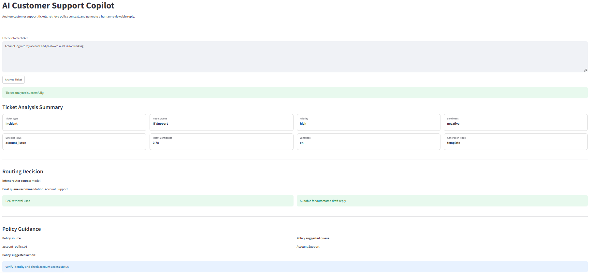
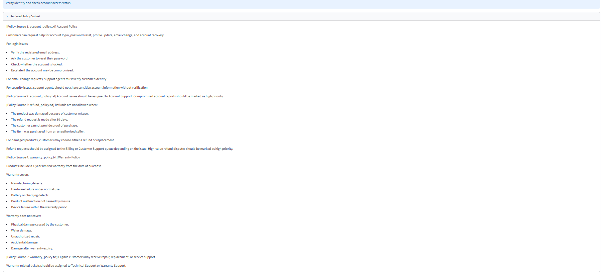
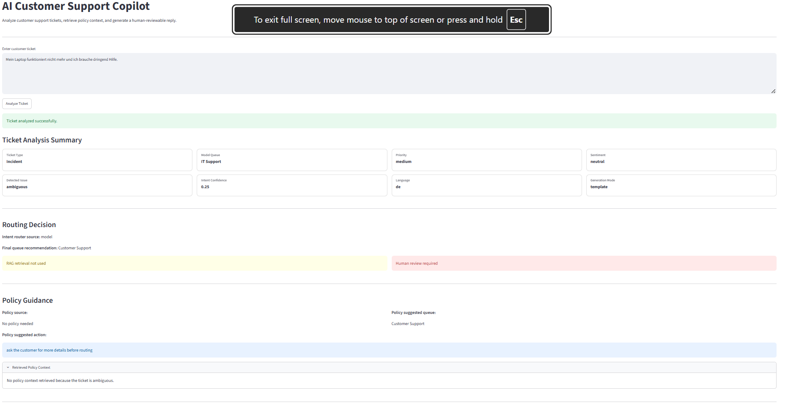

# AI Customer Support Copilot

## Project Overview

AI Customer Support Copilot is an end-to-end AI/ML and NLP project for customer support ticket analysis and response assistance.

The system analyzes a customer ticket, predicts operational metadata, routes the ticket through an intent/workflow layer, conditionally retrieves relevant company policy, and generates a human-reviewable support reply.

```text
Customer ticket
      ↓
Language detection
      ↓
Intent router / workflow classifier
- refund issue
- shipping issue
- account issue
- technical issue
- warranty issue
- sales/product inquiry
- positive feedback
- ambiguous/general inquiry
      ↓
ML metadata predictions
- ticket type
- support queue
- priority
- sentiment
      ↓
Decision layer
- support-policy issue → use multilingual RAG
- sales/product/feedback/ambiguous/general → skip RAG
      ↓
Policy-led or intent-led reply generation
- template mode by default
- optional LLM mode when API quota is available
      ↓
FastAPI backend response
```

The project has completed the local **FastAPI + Streamlit validation stage**. The core ML + intent router + multilingual RAG + reply generation pipeline works through a FastAPI backend and is displayed through a Streamlit dashboard. The remaining major milestone is deployment.

---

## Business Problem

Support teams receive large volumes of customer tickets across different departments. Manual triage is slow, inconsistent, and prone to routing mistakes.

This project helps automate early support handling by:

- classifying ticket type
- recommending a support queue
- predicting ticket priority
- detecting customer sentiment
- detecting workflow intent before RAG
- retrieving company policy context only when needed
- generating a support-agent-reviewable reply

The system is designed as a **decision-support copilot**, not as an unsupervised auto-send bot. The generated reply should be reviewed by a human support agent before sending.

---

## Current Status

| Phase | Module | Status |
|---|---|---|
| Phase 1 | Data understanding and preprocessing | Completed |
| Phase 2 | Ticket type classification | Completed |
| Phase 3 | Queue / department routing classification | Completed |
| Phase 4 | Priority prediction | Completed |
| Phase 5 | Sentiment analysis | Completed |
| Phase 6 | Multilingual RAG knowledge retrieval | Completed |
| Phase 7A | Policy-led template reply generation | Completed |
| Phase 7B | Optional LLM reply generation | Implemented, requires API quota/billing |
| Phase 7.5 | Multilingual RAG and reply cleanup | Completed |
| Phase 8A | Intent router / workflow classifier | Completed |
| Phase 8B | FastAPI backend + validation | Completed |
| Phase 9 | Streamlit dashboard | Completed locally |
| Phase 10 | Deployment | Pending |

---

## Features Completed

### 1. Ticket Type Prediction

Predicts the type of customer support issue.

Example classes:

```text
Change
Incident
Problem
Request
```

Output model:

```text
models/ticket_type_baseline.pkl
```

---

### 2. Ticket Queue Prediction

Predicts which support queue or department should handle the ticket.

Example queues:

```text
Technical Support
Billing and Payments
Product Support
Customer Service
IT Support
Sales and Pre-Sales
Human Resources
Returns and Exchanges
Service Outages and Maintenance
General Inquiry
```

Output model:

```text
models/ticket_queue_baseline.pkl
```

---

### 3. Priority Prediction

Predicts the urgency level of a customer support ticket.

Output model:

```text
models/ticket_priority_baseline.pkl
```

Reports:

```text
reports/priority_model_comparison.csv
reports/wrong_priority_predictions.csv
```

---

### 4. Sentiment Analysis

Predicts customer sentiment as:

```text
positive
neutral
negative
```

The sentiment model was trained using an external Amazon reviews dataset. Review ratings were converted into sentiment labels.

| Rating | Sentiment |
|---|---|
| 1-2 stars | Negative |
| 3 stars | Neutral |
| 4-5 stars | Positive |

Because the ticket dataset contains both English and German tickets, sentiment handling is split:

| Ticket language | Sentiment method |
|---|---|
| English | Trained ML sentiment model |
| German | Lightweight German keyword-rule fallback |

Output model:

```text
models/sentiment_model.pkl
```

Reports:

```text
reports/sentiment_model_comparison.csv
reports/wrong_sentiment_predictions.csv
reports/ticket_sentiment_predictions.csv
```

---

### 5. Intent Router / Workflow Classifier

A trained intent router runs before RAG. It decides whether the ticket should use policy retrieval or follow a non-policy workflow.

Intent labels:

```text
refund_issue
shipping_issue
account_issue
technical_issue
warranty_issue
sales_or_product_inquiry
positive_feedback
general_inquiry
ambiguous
```

Output model:

```text
models/intent_router.pkl
```

Training files:

```text
data/processed/intent_router_dataset.csv
notebooks/09_intent_router.ipynb
```

The router prevents non-support messages like product inquiries, positive feedback, and vague requests from triggering irrelevant RAG retrieval.

Example behavior:

```text
Input:
I want to know about laptop Ryzen 5.

Detected intent:
sales_or_product_inquiry

RAG used:
false
```

---

### 6. Multilingual RAG Knowledge Retrieval

The RAG module retrieves company policy context before reply generation, but only for support-policy issues identified by the intent router.

Traditional classifiers can predict ticket metadata, but they do not know company-specific rules. The RAG layer solves this by searching a local policy knowledge base.

Technologies used:

- LangChain
- Sentence Transformers
- Hugging Face embeddings
- FAISS vector database

Policy knowledge base:

```text
docs/company_policies/
```

Current policy documents:

```text
refund_policy.txt
shipping_policy.txt
warranty_policy.txt
account_policy.txt
technical_support_policy.txt
```

The policy documents are currently written in English, but the FAISS index uses multilingual embeddings so German ticket queries can still retrieve relevant English policy documents.

Embedding model:

```text
sentence-transformers/paraphrase-multilingual-MiniLM-L12-v2
```

Current vectorstore path:

```text
vectorstore/faiss_policy_index_multilingual/
```

Retrieval flow:

```text
English/German ticket
        ↓
Intent router says support-policy issue
        ↓
Multilingual embedding
        ↓
FAISS similarity search
        ↓
Policy reranking / preferred policy selection
        ↓
Relevant English policy context
```

Example:

```text
German ticket:
Ich habe den falschen Artikel erhalten und möchte mein Geld zurück.

Detected intent:
refund_issue

Retrieved policy:
refund_policy.txt
```

Output files:

```text
notebooks/07_rag_knowledge_retrieval.ipynb
src/rag_pipeline.py
reports/rag_test_results.csv
reports/rag_multilingual_test_results.csv
```

---

### 7. Policy-Led and Intent-Led Reply Generation

The reply generator creates professional, human-reviewable support drafts.

The latest reply generation design is **policy-led for support issues** and **intent-led for non-support workflows**:

- ML predictions are kept as internal metadata.
- Intent router decides whether RAG is needed.
- RAG policy context grounds support replies.
- Sales/product, positive feedback, ambiguous, and general inquiries skip RAG.
- Customer-facing replies avoid exposing raw labels like `Incident`, `Problem`, or uncertain predicted queues.
- Sentiment and priority influence tone and urgency wording.
- The final decision layer can override noisy model outputs when the intent is clear.

Output includes:

```text
ticket
language
detected_intent
intent_confidence
intent_router_source
rag_used
requires_human_review
model_predictions
final_priority
final_sentiment
final_queue_recommendation
policy_source
policy_context
policy_suggested_queue
policy_suggested_action
generation_mode
generated_reply
llm_error
```

Output files:

```text
notebooks/08_reply_generation.ipynb
src/generate_reply.py
reports/generated_reply_examples.csv
reports/generated_reply_examples_multilingual.csv
```

---

### 8. Optional LLM Reply Generation

LLM-based reply generation is implemented as an optional mode.

Default behavior:

```python
use_llm=False
```

This uses the free, local, policy-led / intent-led template reply.

Optional behavior:

```python
use_llm=True
```

This attempts to generate a more natural reply using an OpenAI model and the retrieved policy context.

If the LLM call fails because of missing API key, quota, billing, or any runtime issue, the system automatically falls back to the template reply.

This keeps the project usable without paid API access.

Required `.env` variables for optional LLM mode:

```env
OPENAI_API_KEY=your_api_key_here
OPENAI_MODEL=gpt-4.1-mini
```

Important:

```text
ChatGPT subscription and OpenAI API billing are separate.
An API key alone does not guarantee usable quota.
```

---

### 9. FastAPI Backend

The project includes a local FastAPI backend for running the full copilot pipeline through an API.

API files:

```text
api/main.py
```

Main endpoints:

```text
GET /
GET /health
POST /analyze-ticket
```

The backend exposes:

```text
Intent router
ML metadata predictions
Conditional RAG retrieval
Policy-led / intent-led reply generation
Optional LLM mode
```

---

### 10. Streamlit Dashboard

The project includes a local Streamlit dashboard that connects to the FastAPI backend and displays the full customer-support copilot workflow.

Dashboard file:

```text
dashboard/streamlit_app.py
```

The dashboard supports:

```text
Ticket text input
Compact prediction summary cards
Detected intent and intent confidence
Final queue recommendation
RAG retrieval status
Human review flag
Policy source and policy-guided action
Expandable retrieved policy context
Generated support reply
Expandable raw API response
```

#### Dashboard screenshots

##### Main dashboard: English ticket summary



##### RAG policy retrieval evidence



##### German ticket example



---

## Dataset

The main ticket dataset contains multilingual customer support tickets in **English and German**.

Important columns:

| Column | Use |
|---|---|
| `subject` | Short ticket summary |
| `body` | Main ticket description |
| `type` | Target for ticket type classification |
| `queue` | Target for ticket routing |
| `priority` | Target for priority prediction |
| `language` | Used for language-wise evaluation |
| `answer` | Excluded from model input to prevent leakage |

For supervised ticket models, the main input is:

```text
subject + body
```

The following columns are not used as model input:

```text
answer
type
queue
priority
```

`answer` is excluded because it is post-resolution information and would cause data leakage.

The intent router uses a smaller custom dataset:

```text
data/processed/intent_router_dataset.csv
```

This dataset contains English and German examples for support-policy and non-support workflows.

---

## Preprocessing

Text preprocessing includes:

- combining `subject` and `body`
- lowercasing text
- removing URLs
- removing extra whitespace
- preserving German characters during ticket preprocessing
- avoiding aggressive English-only cleaning for multilingual ticket models

For the external Amazon sentiment dataset, review text was cleaned separately for English sentiment classification.

The intent router uses:

```text
Word TF-IDF + Character TF-IDF + Logistic Regression
```

Character TF-IDF helps with German word variations.

---

## Models Tested

For ticket type, queue, and priority prediction:

- TF-IDF + Logistic Regression
- TF-IDF + LinearSVC
- TF-IDF + LinearSVC + GridSearchCV
- Word + Character TF-IDF experiment for multilingual robustness

For sentiment analysis:

- TF-IDF + Logistic Regression
- TF-IDF + LinearSVC

For intent routing:

- Word TF-IDF + Character TF-IDF + Logistic Regression

For RAG retrieval:

- Sentence Transformer embeddings
- multilingual Hugging Face embeddings
- FAISS similarity search
- local policy knowledge base retrieval

Final selected components:

```text
Ticket Type Classifier  : TF-IDF + LinearSVC/GridSearchCV
Ticket Queue Classifier : TF-IDF + LinearSVC/GridSearchCV
Priority Classifier     : TF-IDF-based best classifier
Sentiment Analyzer      : TF-IDF + Logistic Regression + German rule fallback
Intent Router           : Word + Character TF-IDF + Logistic Regression
RAG Retriever           : Multilingual Sentence Transformers + FAISS
Reply Generator         : Policy-led / intent-led template generation + optional LLM mode
API Backend             : FastAPI
Dashboard               : Streamlit
```

---

## Evaluation

Metrics used:

- Accuracy
- Precision
- Recall
- Macro F1-score
- Weighted F1-score
- Confusion matrix
- Wrong prediction analysis
- Language-wise evaluation
- RAG retrieval test cases
- Intent router evaluation
- Generated reply examples
- FastAPI endpoint validation

### Queue Classifier Results

| Model | Accuracy | Macro F1 | Weighted F1 |
|---|---:|---:|---:|
| Logistic Regression | 0.47 | 0.47 | 0.47 |
| LinearSVC | 0.59 | 0.59 | 0.59 |
| LinearSVC + GridSearchCV | 0.61 | 0.60 | 0.61 |

### Queue Language-Wise Evaluation

| Language | Accuracy | Macro F1 | Weighted F1 |
|---|---:|---:|---:|
| German | 0.49 | 0.46 | 0.49 |
| English | 0.70 | 0.71 | 0.70 |

The queue classifier is stronger on English than German. This is documented as a limitation and future improvement area.

### Intent Router Result

The intent router was evaluated on a held-out test split from the custom intent dataset.

```text
Accuracy   : 0.91
Macro F1   : 0.91
Weighted F1: 0.91
```

Example router tests:

| Ticket | Predicted intent |
|---|---|
| `I want to know about laptop Ryzen 5.` | `sales_or_product_inquiry` |
| `Ich habe den falschen Artikel erhalten und möchte mein Geld zurück.` | `refund_issue` |
| `Das Paket wird als zugestellt angezeigt, aber ich habe es nicht erhalten.` | `shipping_issue` |
| `Ich glaube, mein Konto wurde gehackt.` | `account_issue` |
| `Die App stürzt jedes Mal ab, wenn ich sie öffne.` | `technical_issue` |
| `Help me.` | `ambiguous` |

---

## Example End-to-End Output

Example input:

```text
My laptop arrived damaged and I want a refund.
```

Example internal output:

```text
Language: en
Detected Intent: refund_issue
RAG Used: true
Requires Human Review: false

Model Predictions:
- Type: Incident
- Queue: Technical Support
- Priority: high
- Sentiment: negative

Final Priority:
high

Policy Source:
refund_policy.txt

Policy Suggested Queue:
Billing or Customer Support

Generation Mode:
template
```

Example customer-facing reply:

```text
Dear Customer,

We're sorry to hear about the issue you're facing.

Based on your message, we found a relevant company policy related to this issue.

We understand this may need prompt attention, so the support team should review it carefully.

Policy-guided note:
The support team will review refund eligibility and may ask for proof of purchase. For damaged products, a refund or replacement may be available depending on policy conditions.

Recommended next step:
Please keep your order details, product information, screenshots, or proof of purchase available if required by the support team.

Best regards,
Customer Support Team
```

Notice that raw model labels are kept internally instead of being exposed directly in the customer reply.

---

## Project Structure

```text
customer-support-copilot/
├── api/
│   └── main.py
│
├── dashboard/
│   └── streamlit_app.py
│
├── data/
│   ├── raw/
│   └── processed/
│       ├── train.csv
│       ├── test.csv
│       ├── type_mapping.csv
│       ├── queue_mapping.csv
│       ├── sentiment_clean.csv
│       ├── sentiment_train.csv
│       ├── sentiment_test.csv
│       └── intent_router_dataset.csv
│
├── docs/
│   ├── company_policies/
│   │   ├── refund_policy.txt
│   │   ├── shipping_policy.txt
│   │   ├── warranty_policy.txt
│   │   ├── account_policy.txt
│   │   └── technical_support_policy.txt
│   └── screenshots/
│       ├── streamlit_english_ticket.png
│       ├── streamlit_english_policy_context.png
│       └── streamlit_german_ticket.png
│
├── notebooks/
│   ├── 01_data_exploration.ipynb
│   ├── 02_preprocessing.ipynb
│   ├── 03_type_classifier.ipynb
│   ├── 04_queue_classifier.ipynb
│   ├── 05_priority_classifier.ipynb
│   ├── 06_sentiment_analysis.ipynb
│   ├── 07_rag_knowledge_retrieval.ipynb
│   ├── 08_reply_generation.ipynb
│   └── 09_intent_router.ipynb
│
├── scripts/
│   ├── test_fastapi_outputs.py
│   └── summarize_fastapi_outputs.py
│
├── src/
│   ├── predict_ticket.py
│   ├── rag_pipeline.py
│   └── generate_reply.py
│
├── vectorstore/
│   └── faiss_policy_index_multilingual/
│
├── models/
│   ├── ticket_type_baseline.pkl
│   ├── ticket_queue_baseline.pkl
│   ├── ticket_priority_baseline.pkl
│   ├── sentiment_model.pkl
│   └── intent_router.pkl
│
├── reports/
│   ├── type_model_comparison.csv
│   ├── queue_model_comparison.csv
│   ├── priority_model_comparison.csv
│   ├── sentiment_model_comparison.csv
│   ├── wrong_type_predictions.csv
│   ├── wrong_queue_predictions.csv
│   ├── wrong_priority_predictions.csv
│   ├── wrong_sentiment_predictions.csv
│   ├── ticket_sentiment_predictions.csv
│   ├── rag_test_results.csv
│   ├── rag_multilingual_test_results.csv
│   ├── generated_reply_examples.csv
│   ├── generated_reply_examples_multilingual.csv
│   ├── fastapi_test_outputs.json
│   └── fastapi_test_summary.csv
│
├── README.md
├── requirements.txt
└── .gitignore
```

---

## How to Run

### 1. Create and activate virtual environment

```bash
python -m venv venv
source venv/Scripts/activate
```

### 2. Install dependencies

```bash
pip install -r requirements.txt
```

### 3. Build or rebuild multilingual FAISS index

Run:

```bash
jupyter notebook
```

Then execute:

```text
notebooks/07_rag_knowledge_retrieval.ipynb
```

This creates:

```text
vectorstore/faiss_policy_index_multilingual/
```

### 4. Test RAG retrieval

```bash
python src/rag_pipeline.py
```

### 5. Train or confirm intent router

Make sure this file exists:

```bash
ls models/intent_router.pkl
```

If missing, run:

```text
notebooks/09_intent_router.ipynb
```

### 6. Run full reply generation locally

```bash
python src/generate_reply.py
```

### 7. Run FastAPI backend

```bash
uvicorn api.main:app --reload
```

The API runs at:

```text
http://127.0.0.1:8000
```

Swagger UI:

```text
http://127.0.0.1:8000/docs
```

### 8. Health check

```bash
curl http://127.0.0.1:8000/health
```

Expected response:

```json
{
  "status": "ok",
  "service": "customer-support-copilot"
}
```

### 9. Analyze a ticket through API

Endpoint:

```text
POST /analyze-ticket
```

Example request:

```json
{
  "ticket_text": "My laptop arrived damaged and I want a refund.",
  "use_llm": false
}
```

Example response fields:

```text
ticket
language
detected_intent
intent_confidence
intent_router_source
rag_used
requires_human_review
model_predictions
final_priority
final_sentiment
final_queue_recommendation
policy_source
policy_context
policy_suggested_queue
policy_suggested_action
generation_mode
generated_reply
llm_error
```

### 10. Save FastAPI validation outputs

Run the API first:

```bash
uvicorn api.main:app --reload
```

Then in another terminal:

```bash
python scripts/test_fastapi_outputs.py
python scripts/summarize_fastapi_outputs.py
```

Expected reports:

```text
reports/fastapi_test_outputs.json
reports/fastapi_test_summary.csv
```

### 11. Run Streamlit dashboard

Start the FastAPI backend first:

```bash
uvicorn api.main:app --reload
```

Then open a second terminal and run:

```bash
streamlit run dashboard/streamlit_app.py
```

The dashboard runs at:

```text
http://localhost:8501
```

The dashboard calls:

```text
POST http://127.0.0.1:8000/analyze-ticket
```

### 12. Optional LLM mode

Create `.env` in the project root:

```env
OPENAI_API_KEY=your_api_key_here
OPENAI_MODEL=gpt-4.1-mini
```

Then test only one or two examples:

```bash
python -c "from src.generate_reply import analyze_ticket_and_generate_reply; r=analyze_ticket_and_generate_reply('My laptop arrived damaged and I want a refund.', use_llm=True); print(r['generation_mode']); print(r['generated_reply'])"
```

If quota or billing is unavailable, the system falls back to template mode.

---

## Current Limitations

- LinearSVC decision scores are not true probabilities.
- German queue classification is weaker than English queue classification.
- `Problem` and `Incident` can be confused.
- Some queue labels overlap, especially Technical Support, IT Support, and Product Support.
- Sentiment analysis is trained on an external English review dataset, not the original ticket dataset.
- German sentiment currently uses a keyword-rule fallback, not a trained German sentiment model.
- Policy documents are currently English-only.
- German tickets can retrieve English policy documents through multilingual embeddings, but the knowledge base is not fully bilingual yet.
- LLM reply generation is implemented but requires valid API quota/billing.
- The current RAG policy base is small and manually created.
- Intent router dataset is small and partially synthetic, so new real failure cases should be added over time.
- FastAPI is validated locally but not deployed yet.
- Streamlit dashboard is completed locally, but the frontend/backend are not deployed yet.

---

## Future Improvements

Planned next modules and upgrades:

- Cloud deployment of FastAPI backend and Streamlit dashboard
- Larger multilingual policy knowledge base
- German policy documents
- Better German sentiment model using German or multilingual sentiment data
- Improve German queue classification
- Expand intent router dataset with real failed examples
- Add RAG relevance thresholding
- Reduce duplicate policy chunks in API response
- Optional OpenAI/LLM-powered response generation in production mode
- Human approval workflow before sending generated replies
- Model monitoring and feedback loop from support agent corrections

---

## Next Milestone

```text
Phase 10: Deployment
```

Immediate tasks:

```text
1. Save final Streamlit screenshots in docs/screenshots/.
2. Run FastAPI validation scripts and keep reports/fastapi_test_outputs.json plus reports/fastapi_test_summary.csv.
3. Commit and push the completed FastAPI + Streamlit dashboard stage.
4. Prepare deployment files for backend/frontend.
5. Deploy and document live URLs.
```

Local backend command:

```bash
uvicorn api.main:app --reload
```

Local dashboard command:

```bash
streamlit run dashboard/streamlit_app.py
```

Main FastAPI endpoint:

```text
POST /analyze-ticket
```

Example response:

```json
{
  "ticket": "My product arrived damaged and I want a refund urgently.",
  "language": "en",
  "detected_intent": "refund_issue",
  "intent_confidence": 0.66,
  "intent_router_source": "model",
  "rag_used": true,
  "requires_human_review": false,
  "model_predictions": {
    "ticket_type": "Incident",
    "queue": "Product Support",
    "priority": "high",
    "sentiment": "negative"
  },
  "final_priority": "high",
  "final_sentiment": "negative",
  "final_queue_recommendation": "Billing or Customer Support",
  "policy_source": "refund_policy.txt",
  "policy_suggested_queue": "Billing or Customer Support",
  "generation_mode": "template",
  "generated_reply": "Dear Customer..."
}
```
